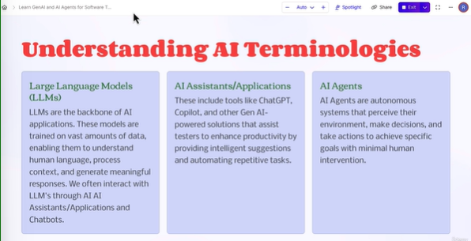
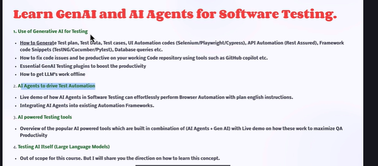
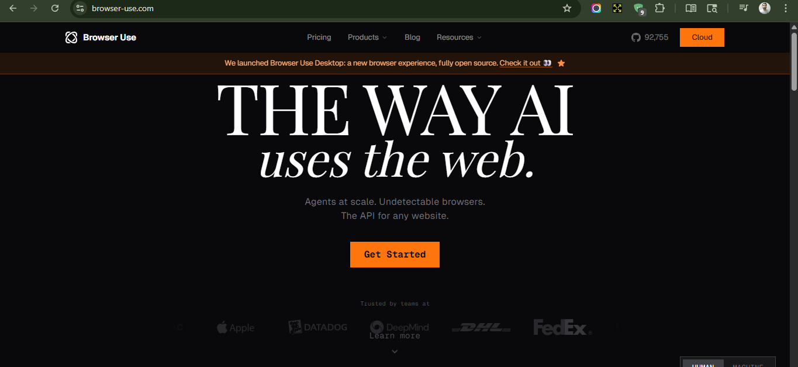
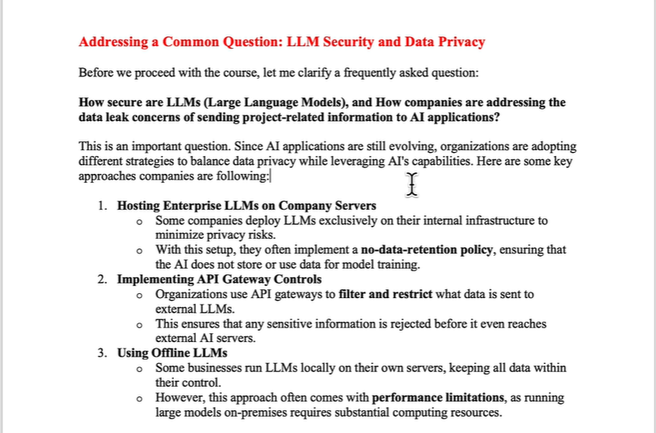
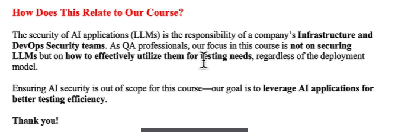

# GenAI & AI Agents for QA Automation | Copilot & Claude code

## Course Link

* https://www.udemy.com/course/generative-ai-in-software-testing/learn/lecture/45262427#overview 

## Understanding AI Terminologies

Link - https://browser-use.com/

