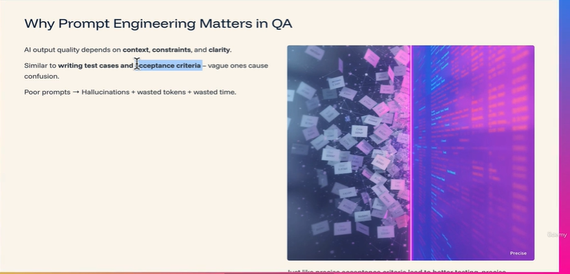
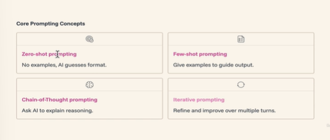
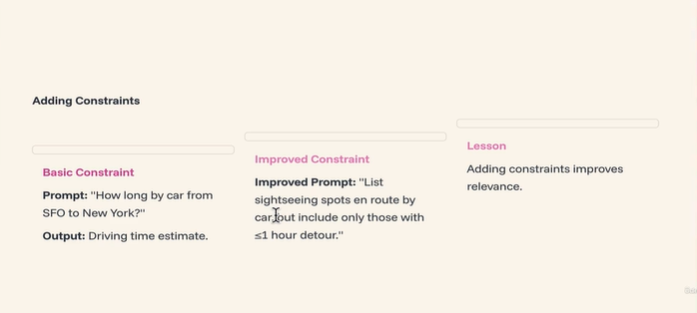
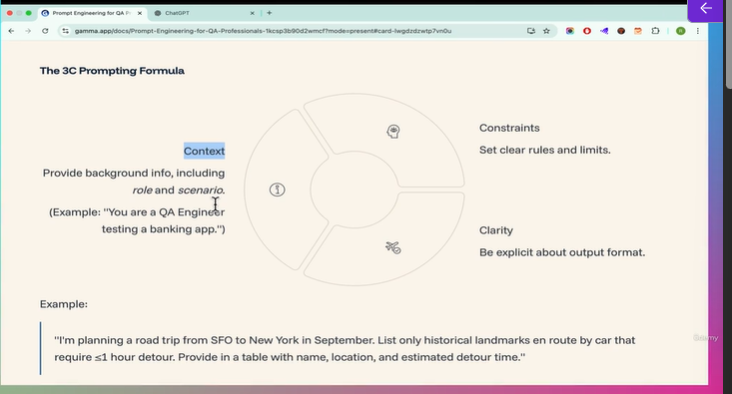
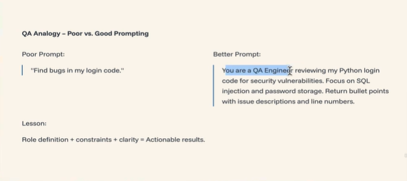
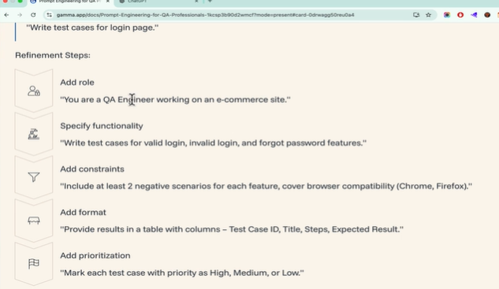
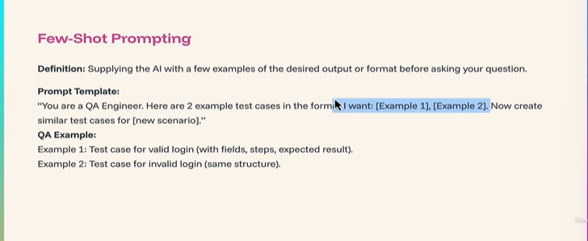
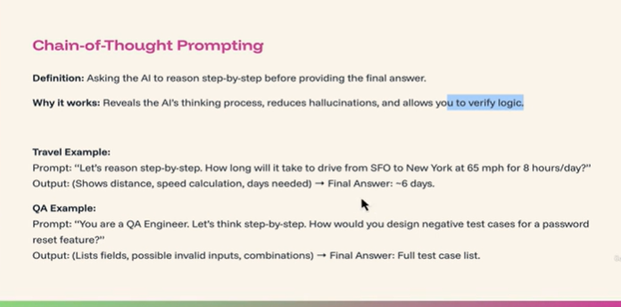

# Prompt Engineering - Understand 3 C's - Context, Constraints, Clarity 

> AI will hallucinates if you don't give proper prompt. Basically it will assume and it may give weird and vague answers
> You cannot blame AI here.
> Also it will waste your response tokens and obviously waste time

## Adding Constraints to leverage Zero shot prompting for better AI results

> It's not about only prompting skill only. You should have technical knowledge also because AI gives you an answer, but who will judge whether it is a correct answer or not  

## Practice scenarios for crafting prompts better & Few shot prompting techique

> So it's a human mind which guides AI to get better output. AI itself will not give you better output. Human in loop play a key role in using AI better

* Here you also provide your output samples  

* Chain of thought prompting
