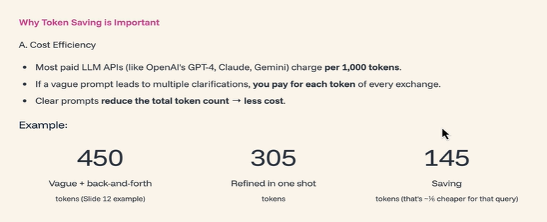
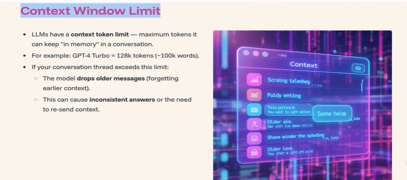
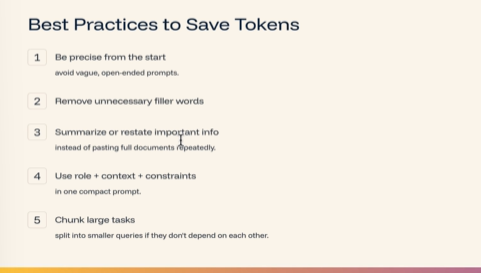
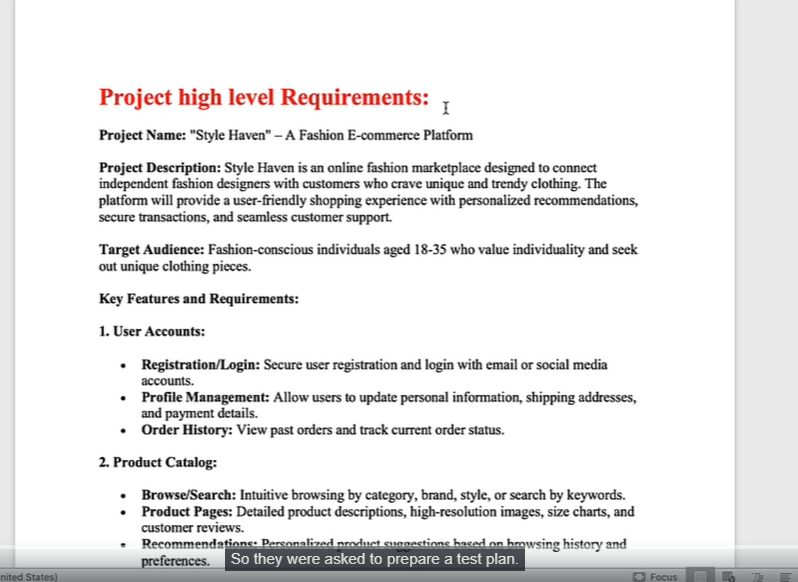
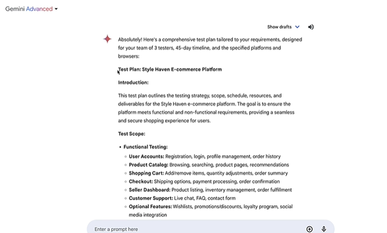
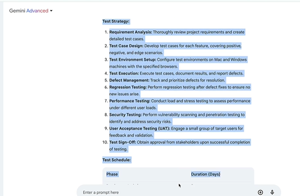
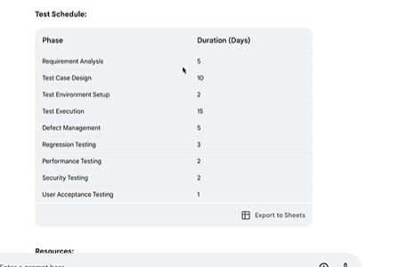

# Understand Tokens & Generate Test Plan, Test Cases, Test Strategy using AI

## Understand How Context Window Limit works

> If you give 1000's of prompts in the conversation in the same window, you will see that limit exceeded the context window. Start the fresh chat again.    
> I'm sure most of you have gone through it because **you cannot continuously chat in the same context window forever**  
> When you are asking follow up questions, it is having in its memory on our previous conversations also.  
> You cannot use same thread for 2-3 months asking 1000s of questions. It has a limit and after crossing the limit model will drop its performance. It will forgot older conversations  

* Solution
  * Prompt in better way in the beginning only

* Prompt engineering is not only for time, price it's also for getting proper outputs.

## Best Practices to save tokens

* So prompt engineering is a skill. It's an art of asking AI to get right answers with the right questions
* So keep all above in mind and prompt your prompt better so you will save time, tokens, hallucinations and get better outputs on time

## Generating Test Plan for the Project business requirements using AI

**File uploaded** - requirements_ai.docx

**Prompt** - Below are my requirements. I have 3 testers. I have 45 days. Testing should be performed in MAC and windows. Browsers are Chrome and Safari.

In above prompt context and constraints are clearly given for AI to generate test plan

> So usually people take 1 or 2 days to come up with a test plan. But with AI you get test plan in a minute  

> So above is what we are telling to the business. So that is our test strategy, all that we have to include in test plan  
> The beauty part here is you need not write everything or think everything.  
> Take the copy, put it in your word document and make edits on high level