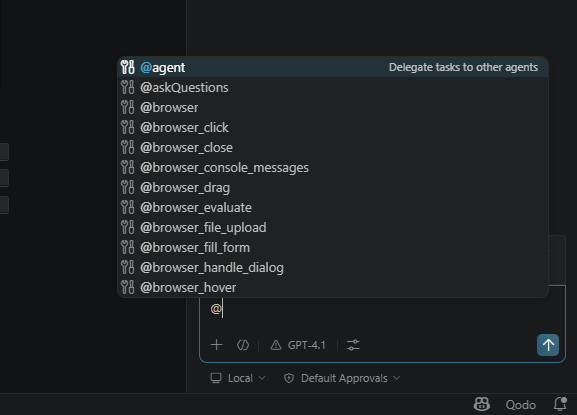
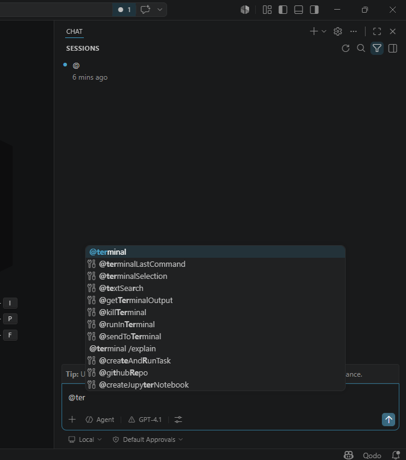
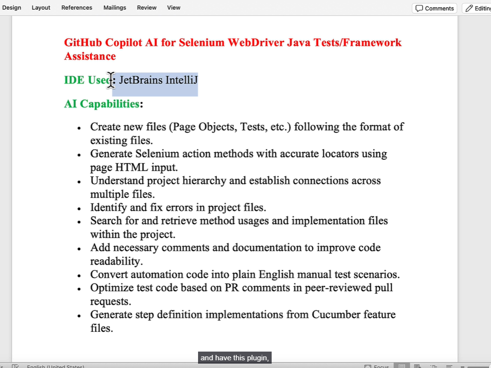

# GitHub Copilot extension for Fixing Code issues

* Below are basically Copilot Agent tools/commands that allow GitHub Copilot to interact with your local development environment instead of only chatting.
* This is where Copilot becomes more like an “AI engineering assistant” rather than just autocomplete.

