# Build Automation AI Agents with Model Context Protocol(MCP) Servers    

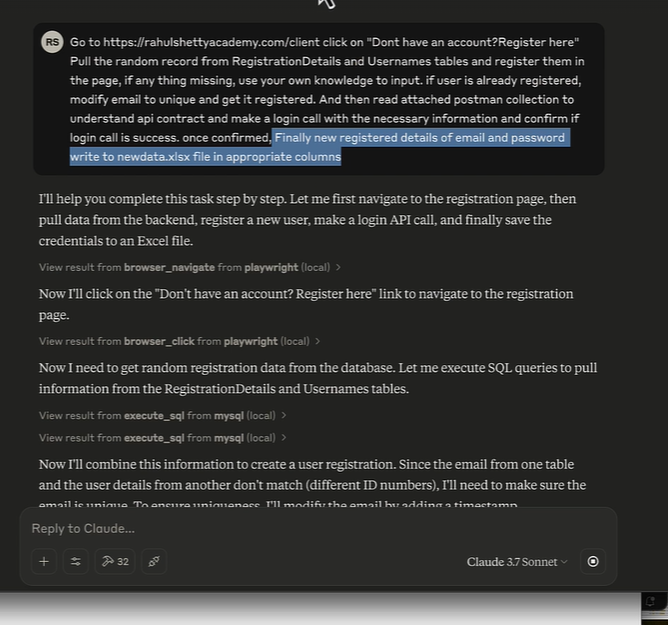

* AI Agent = LLM + MCP  

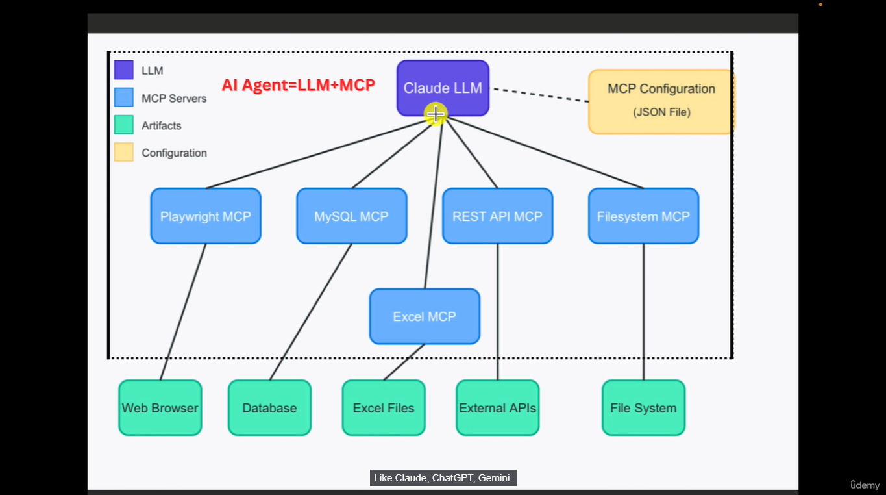

* Website - https://modelcontextprotocol.io/docs/getting-started/intro

## General Architecture

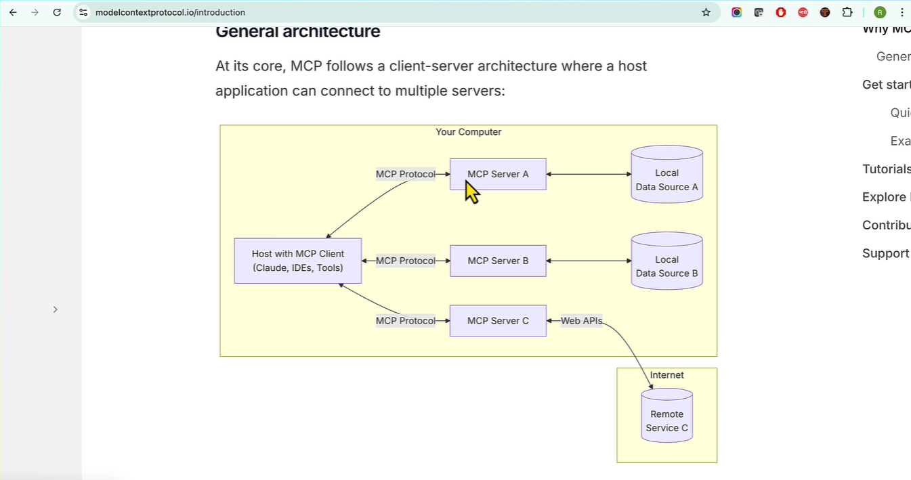

* **MySQL MCP Server**

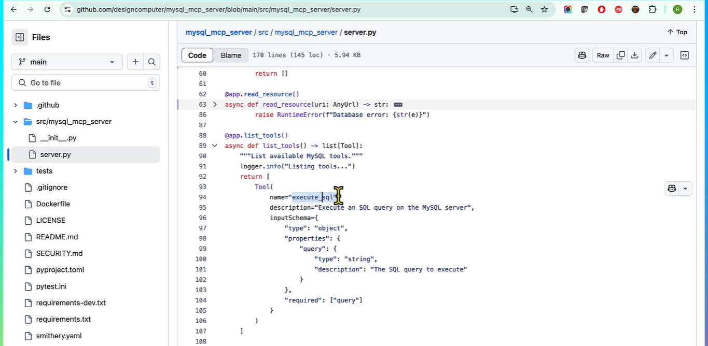

* **Playwright MCP**

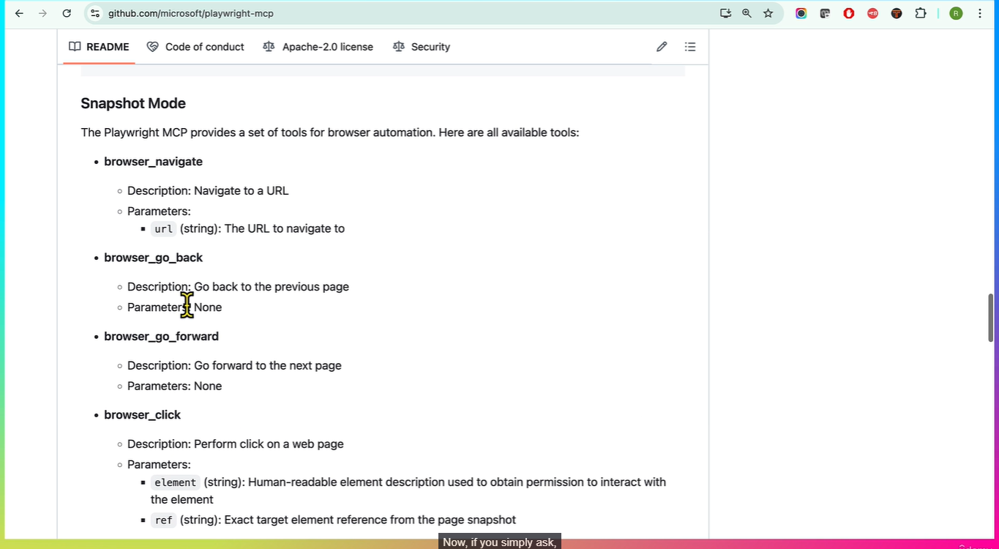

* **Selenium MCP server**

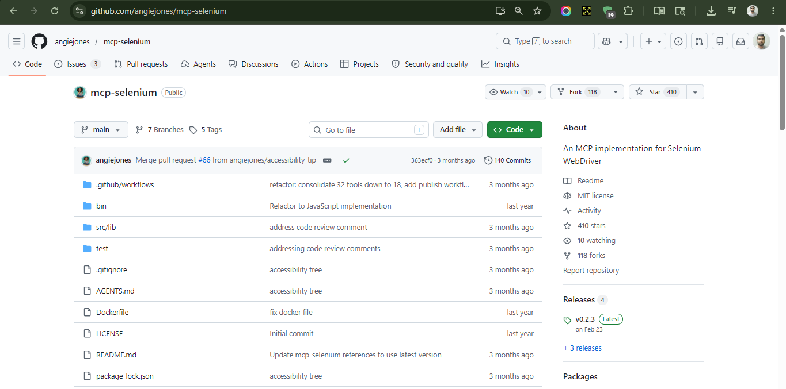

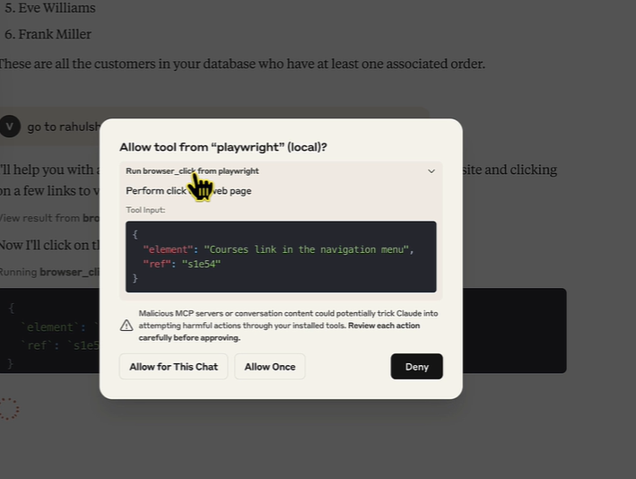

> It's good to ask because somebody is acting behalf of you on your own system  
> So you should be careful that right methods are being executed  

### Episode 2 - 

MCP Client - Claude

Download Claude -  

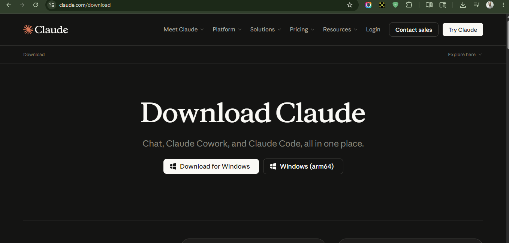

Edit config - 

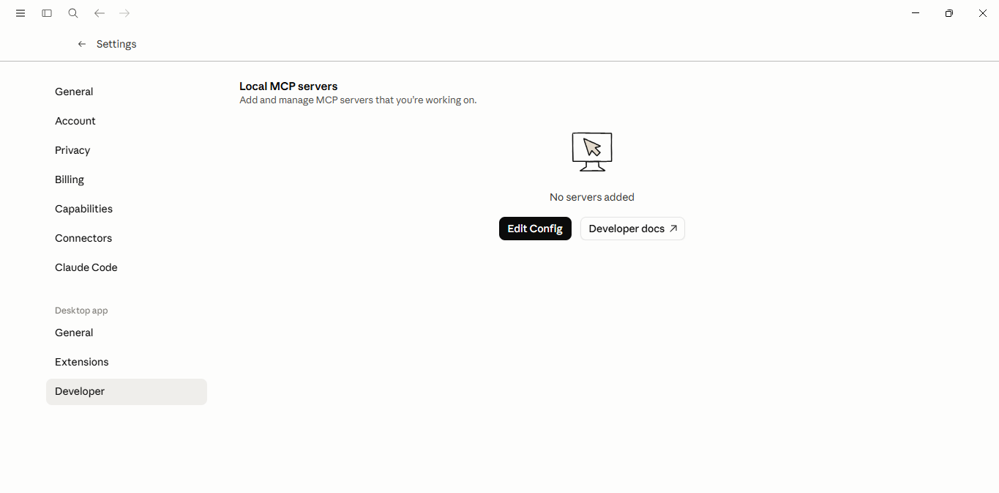

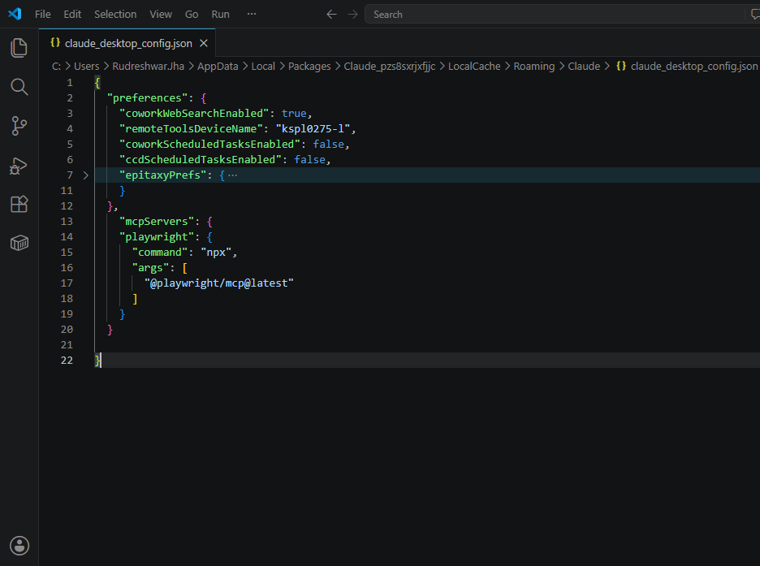

### Episode 3 - 

* Prompt -
 
```txt
navigate to https://rahulshettyacademy.com/client/#/auth/login
click on "Don't have an account? Register here" link
```

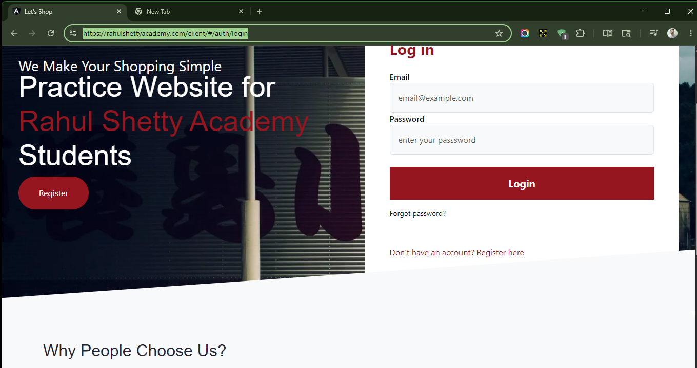

## 23 - Build Agent which can extract data from SQL database by framing complex queries

Repo - https://github.com/designcomputer/mysql_mcp_server

```sql
{
  "mcpServers": {
    "mysql": {
      "command": "uv",
      "args": [
        "--directory",
        "path/to/mysql_mcp_server",
        "run",
        "mysql_mcp_server"
      ],
      "env": {
        "MYSQL_HOST": "localhost",
        "MYSQL_PORT": "3306",
        "MYSQL_USER": "your_username",
        "MYSQL_PASSWORD": "your_password",
        "MYSQL_DATABASE": "your_database"
      }
    }
  }
}
```

```sh
C:\Users\Rudreshwar.Jha>pip install uv
Defaulting to user installation because normal site-packages is not writeable
Collecting uv
  Downloading uv-0.11.15-py3-none-win_amd64.whl.metadata (12 kB)
Downloading uv-0.11.15-py3-none-win_amd64.whl (24.7 MB)
   ━━━━━━━━━━━━━━━━━━━━━━━━━━━━━━━━━━━━━━━━ 24.7/24.7 MB 30.7 MB/s eta 0:00:00
Installing collected packages: uv
Successfully installed uv-0.11.15

[notice] A new release of pip is available: 24.3.1 -> 26.1.1
[notice] To update, run: python.exe -m pip install --upgrade pip

C:\Users\Rudreshwar.Jha>
```

```sh

C:\Users\Rudreshwar.Jha>pip show uv
Name: uv
Version: 0.11.15
Summary: An extremely fast Python package and project manager, written in Rust.
Home-page: https://pypi.org/project/uv/
Author:
Author-email: "Astral Software Inc." <hey@astral.sh>
License:
Location: C:\Users\Rudreshwar.Jha\AppData\Roaming\Python\Python313\site-packages
Requires:
Required-by:

C:\Users\Rudreshwar.Jha>

```

`where uv`

DB setup is done

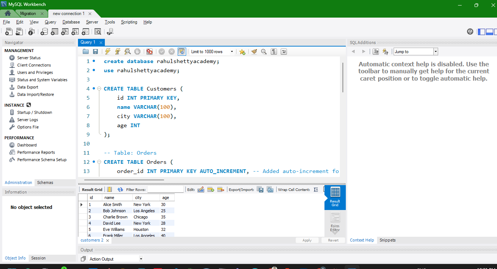