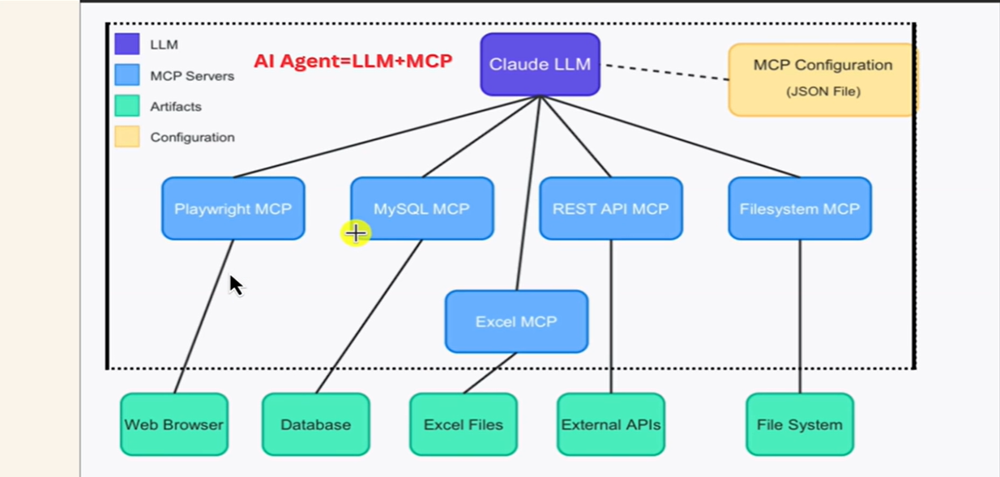
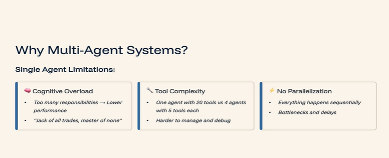
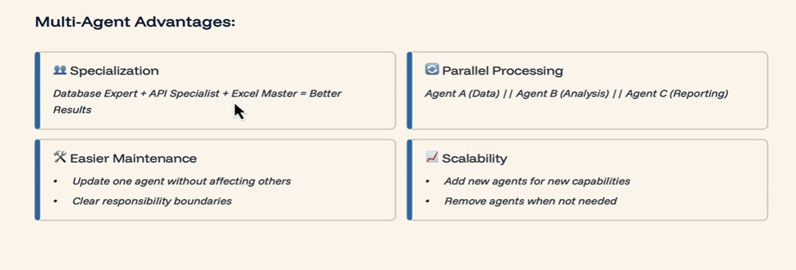
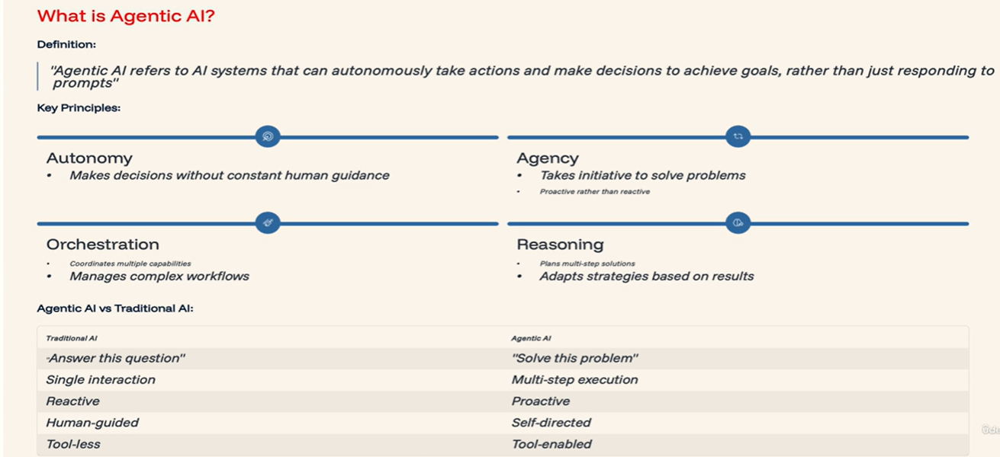
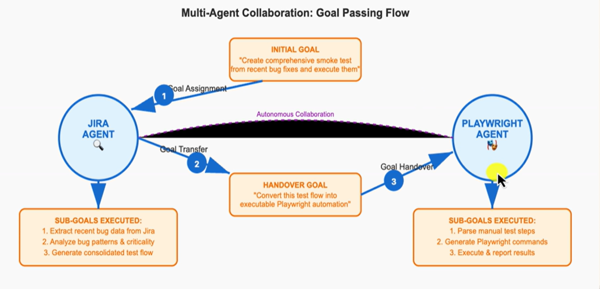
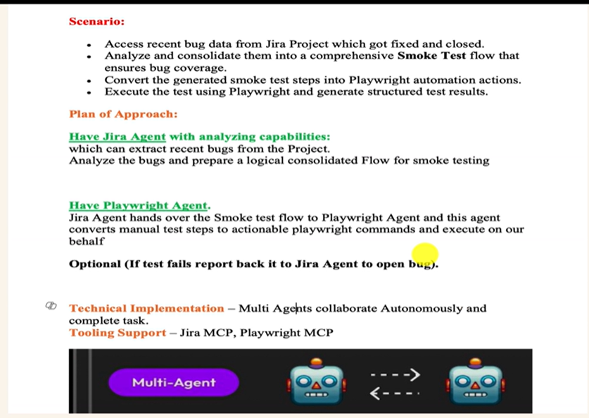
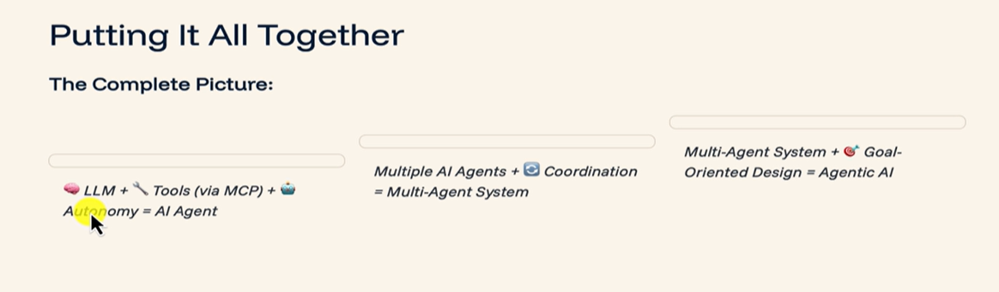
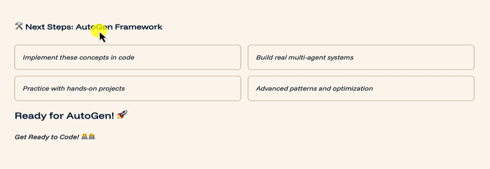
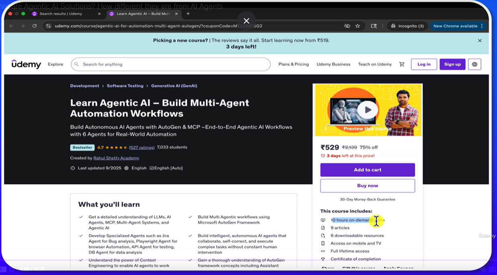

# Connect the dots of Sub Agents, Multi Agent Collaboration, Agentic AI Solutions

## Advantages of Multi Specialized Agents than Single Agent holding Multiple roles

* Multi-Agent Advantages : 

## What are Agentic AI Solutions? How different they are from AI Agents

* **What is Agentic AI?**

* **Multi-Agent Collaboration : Goal Passing Flow**

### Putting It All Together  

* To do Multi-Agent Collaboration - It's a separate learning path

### Next Steps - AutoGen Framework

