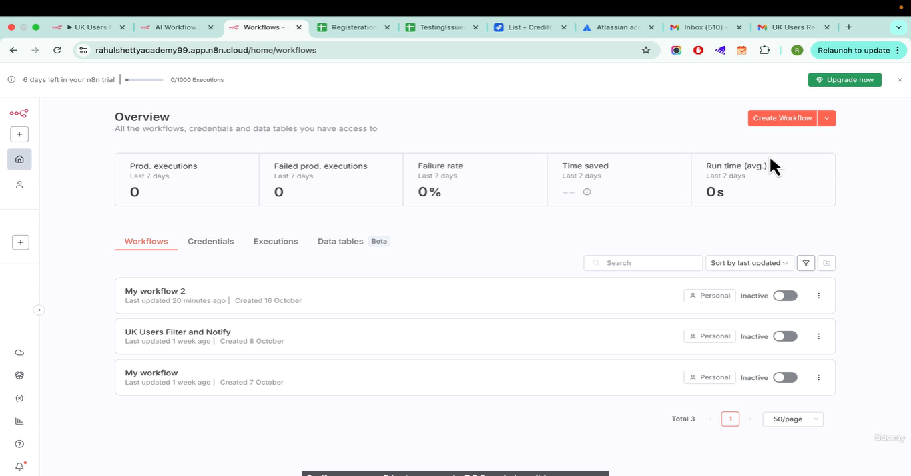
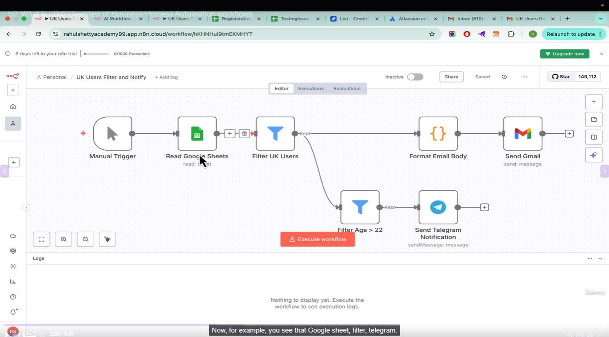
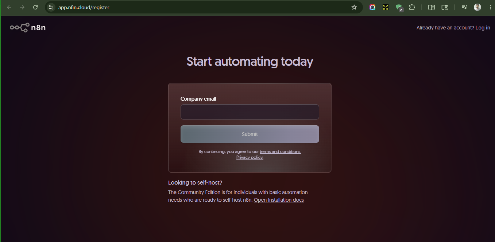
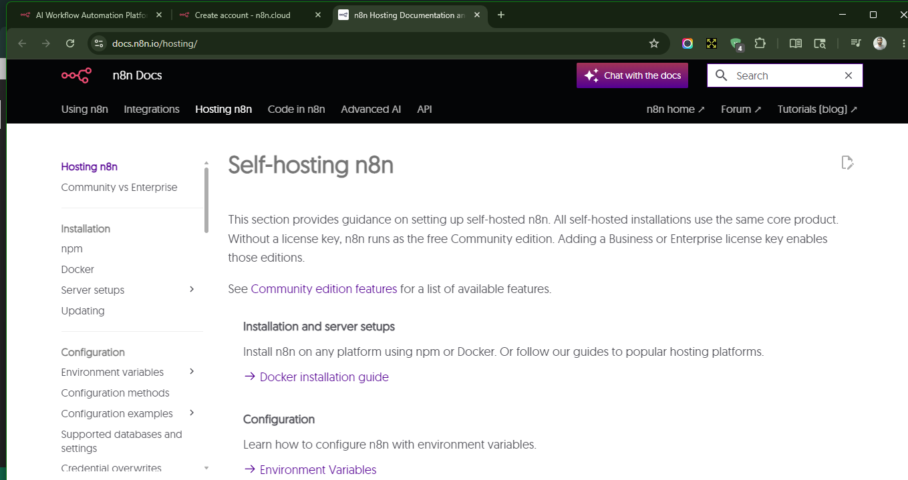

# What is n8n and business process automation workflows

* It's been there for a while but with AI it's capacity has increased
* create a free account for 14 day free-trial and you can do a POC and show it in your company to do actual licence

* You will require company email id

or else you can use community version of self-hosting

## How n8n revolutionized with AI Agents encapsulation

* Now let's see how AI agents can do the work of filtering, sending email, extracting sheet data etc