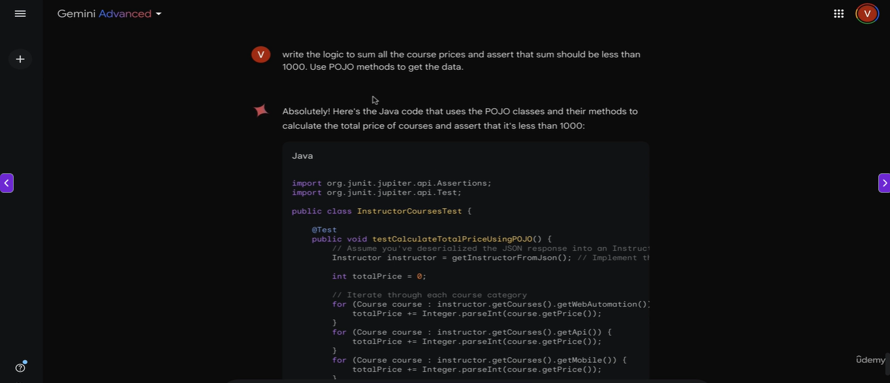

# Test Automation Code for API Testing

* Prompt - Below is API JSON response. Generate API Schema for this
* Prompt - Here is the Schema. Generate test cases to test this JSON response

## Generating POJO Classes for complex JSON

