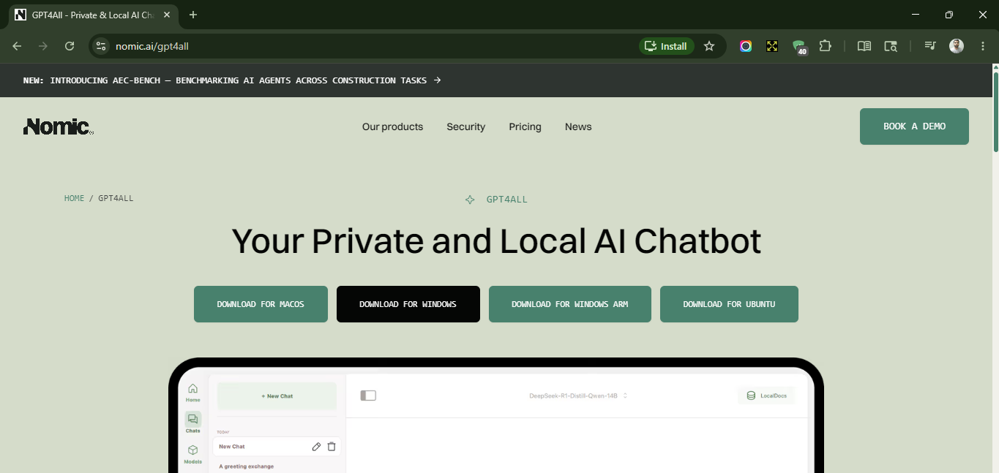
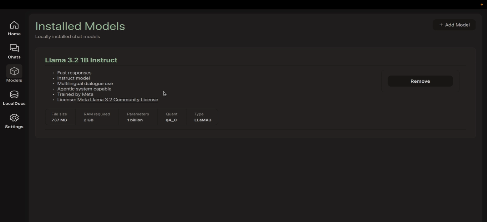
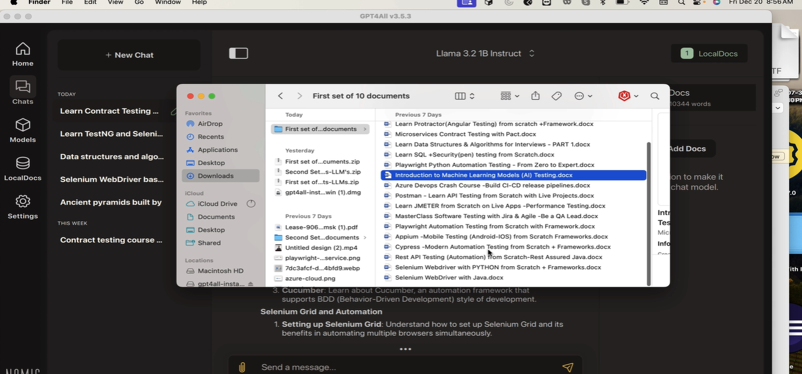
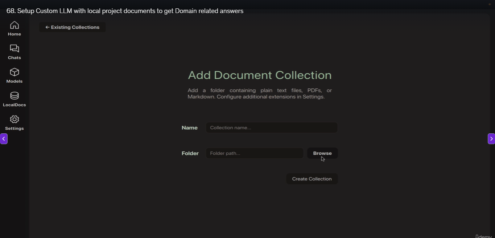
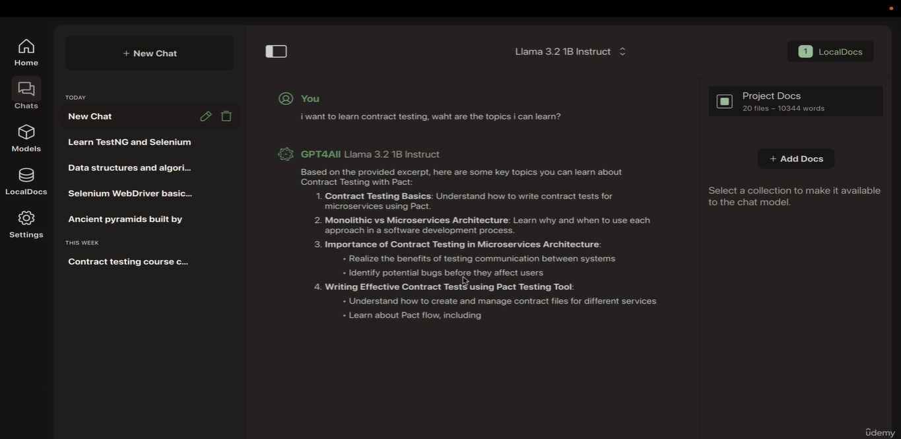
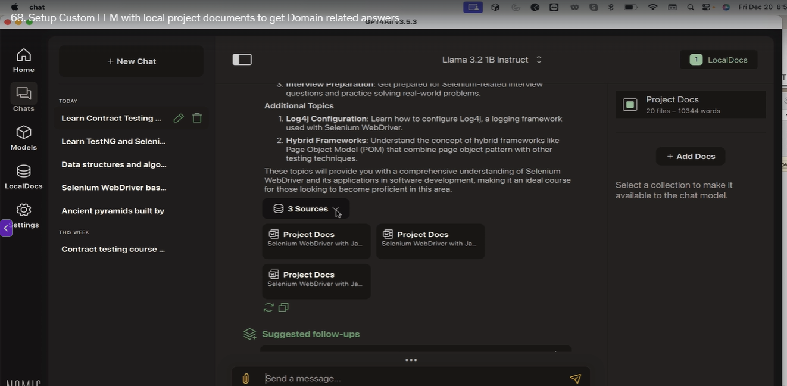
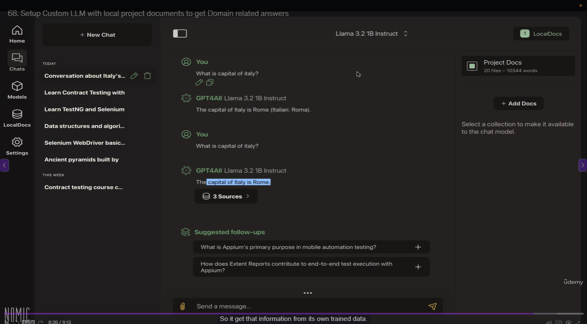
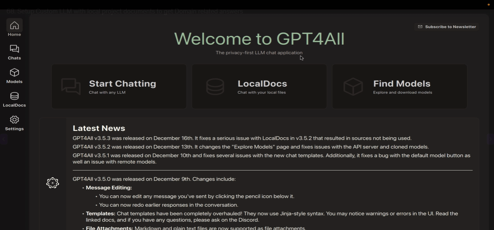

# Privacy First, Offline LLM models handle your project domain

Navigate to - 

* If in company they don't allow, you can download and use it offline and cut off the wifi
* Install the model with less RAM required according to your laptop

you can set up your local custom LLM model by uploading your document

It will also tell you from which sources it has taken the information  

like this you can also upload your project function document  

If it does not find information in uploaded document it will still give you the answers from it's own trained data  

* **so it's a privacy chat LLM application and by that we are not leaking our application into the cloud and I am sure they will agree with it**
  * e.g. where if you have strict banking application where you are not allowed talk to AI models

